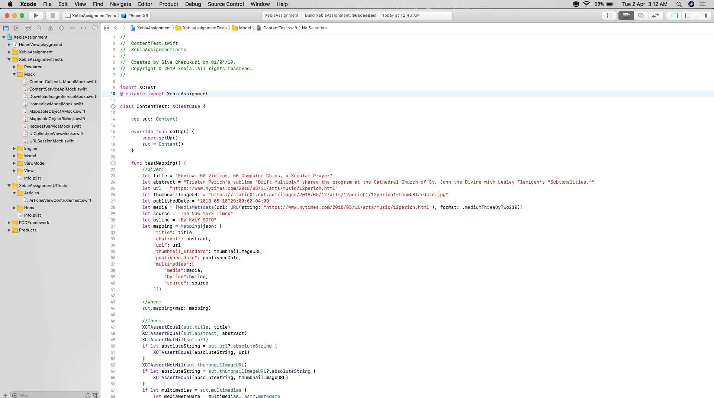
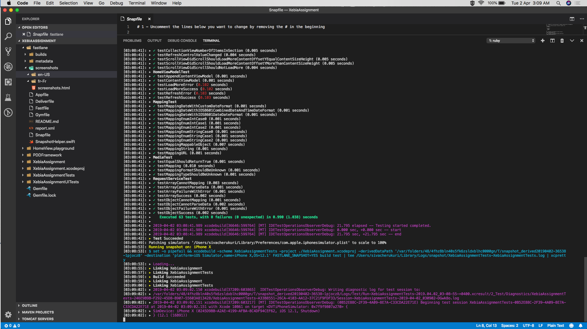
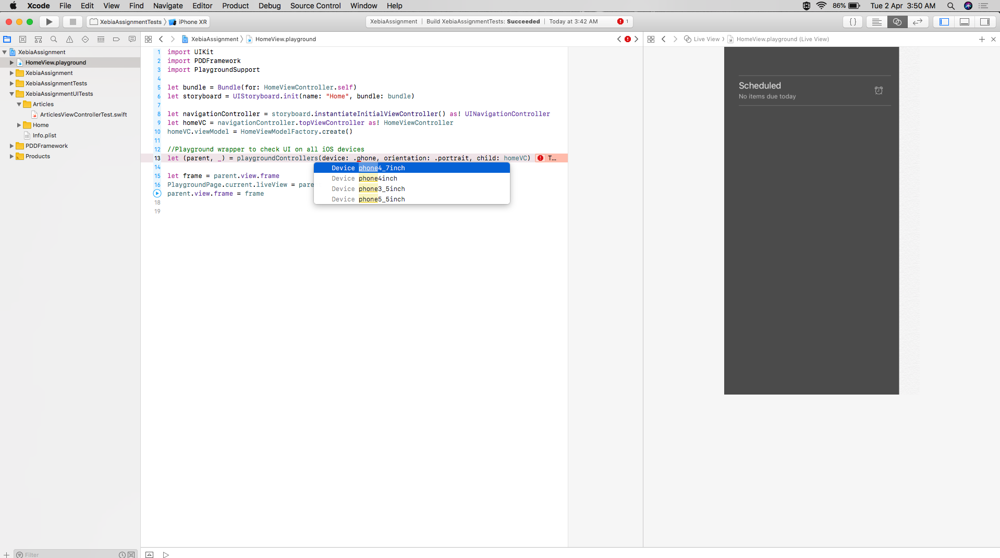

# XebiaAssignment

This is a simple app to display the NY Times Most Popular Articles. 

This application developed using MVVM design pattern. 

- Structure:
    - **Engine**:
        - **Constant**: Contains all constants
        - **Service**: Contains all service api related to network
        - **Extension**: Contains categories
        - **Utility**: Contains utility classes like Mapping JSON
        - **Factory**: Contains classes to facilitate creating instances
    - **Model**: Contains all entities like `Content`, `Media`
    - **ViewModel**:
        - **Home**: Contains all `viewModel`s for **Home** screen 
    - **View**: 
        - **Home**: Contains all `viewController`s, `cell`s  for **Home** screen 
    - **Storyboard**: Contains all storyboards.
    - **Resource**: Images
- Swift 4
- MVVM
- The app supported dynamic fonts.
-  We need to signup for an API key at: https://developer.nytimes.com/get-started.
- Then change `api-key`: Open `API.swift`, go to the bottom, change the value of constant: `NewYorkTimesKey`

### Added 65 unit test cases.

### Integrated Fastlane. 

Run "bundle exec fastlane screenshot" command from the project root folder to run the test cases. 
Use this link [Fastlane-Tutorial](https://www.raywenderlich.com/233168-fastlane-tutorial-getting-started) to install required plugins

### Playground Driven Development(Similar to ReactJS hot reload) 

To test the UI and Functionality. Instead of launching the different simulators we can change
the Device type and Orientations and can observe UI and functionality changes.. 

